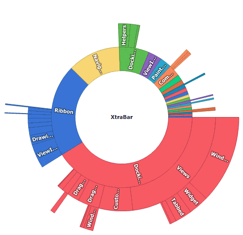

<!-- default badges list -->

<!-- default badges end -->
## How to: implement the Drill-Down functionality in Sunburst

This example demonstrates how to create a drill-down sunburst.

### Description

Handle the **MouseUp** event. 

In the event handler, call the [SunburstControl.CalcHitInfo](https://documentation.devexpress.com/WindowsForms/DevExpress.XtraTreeMap.SunburstControl.CalcHitInfo.method) method to obtain information about a test point. Check whether the test point is in a sunburst item using the [SunburstHitInfo.InSunburstItem](https://documentation.devexpress.com/WindowsForms/DevExpress.XtraTreeMap.SunburstHitInfo.InSunburstItem.property) property. Use the [SunburstHitInfo.SunburstItem](https://documentation.devexpress.com/WindowsForms/DevExpress.XtraTreeMap.SunburstHitInfo.SunburstItem.property) property to access the item and assign its [Tag](https://documentation.devexpress.com/WindowsForms/DevExpress.XtraTreeMap.SunburstItem.Tag.property) property value to the [DataAdapter.DataSource](https://documentation.devexpress.com/WindowsForms/DevExpress.XtraTreeMap.SunburstHierarchicalDataAdapter.DataSource.property) property. The sunburst is redrawn after its data source is changed. 

In this example, click on the sunburst center label to return the previous control's state. Use the [SunburstHitInfo.InCenterLabel](https://documentation.devexpress.com/WindowsForms/DevExpress.XtraTreeMap.SunburstHitInfo.InCenterLabel.property) property to check whether the test point is in the sunburst's center label.
